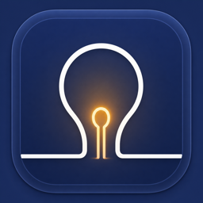

<p align="center">
  
</p>

<h1 align="center">YeelightBar</h1>

<p align="center">
  A native, privacy-friendly macOS menu bar controller for Yeelight-compatible LAN lights.
</p>

<p align="center">
  <a href="https://github.com/bekircem/YeelightBar/releases/latest"></a>
  <a href="https://github.com/bekircem/YeelightBar/actions/workflows/ci.yml"></a>
  
  <a href="LICENSE"></a>
</p>

<p align="center">
  <a href="#installation">Installation</a> ·
  <a href="#first-run">First run</a> ·
  <a href="#features">Features</a> ·
  <a href="#security-and-privacy">Security</a> ·
  <a href="#building-from-source">Development</a>
</p>

YeelightBar controls compatible Wi-Fi lights directly over your local network. There is no YeelightBar account, cloud relay, analytics, advertising, or telemetry. The app lives in the menu bar and stays out of the Dock.

## Installation

### Homebrew

```sh
brew install --cask bekircem/yeelightbar/yeelightbar
```

Update later with:

```sh
brew upgrade --cask --greedy-auto-updates yeelightbar
```

Starting with version 1.1.0, Homebrew installs can also use YeelightBar's signed in-app updater. The cask declares this with `auto_updates true`; both update paths install the same Developer ID-signed and notarized app.

> [!IMPORTANT]
> Version 1.0.0 does not contain the in-app updater. Users on 1.0.0 must install 1.1.0 once from the DMG or Homebrew; later versions can be installed from **Check for Updates…**.

### Signed DMG

Download the latest `YeelightBar-X.Y.Z.dmg` and optional checksum file from [GitHub Releases](https://github.com/bekircem/YeelightBar/releases/latest). Open the DMG, then drag **YeelightBar** to **Applications**.

Stable DMGs are signed with Developer ID, notarized by Apple, stapled, and published with a SHA-256 checksum and GitHub artifact attestation. You should not need to bypass Gatekeeper.

## First run

1. Enable **LAN Control** for your light in the Yeelight mobile app.
2. Make sure the Mac and light are on the same trusted local network.
3. Open YeelightBar from Applications and allow Local Network access when macOS asks.
4. Open the menu bar item, click the discovery button, and review the discovered light.
5. Add the light to trust it. YeelightBar does not automatically connect to the first device it finds.

> [!NOTE]
> YeelightBar is a menu-bar-only (`LSUIElement`) app. It intentionally has no Dock icon. If its menu bar icon is not visible, check the area near Control Center and close older development copies of the app.

## Features

- Power, brightness, color temperature, RGB, and HSV controls, shown according to the selected light's capabilities
- Reusable static looks, favorites, and local color flows
- A responsive Modes & Flows library with custom flow creation
- Global keyboard shortcuts for common controls and direct mode activation
- Explicitly trusted devices, manual connection, discovery controls, and endpoint-change approval
- Launch at Login using the native macOS login-item service
- Sandboxed preferences import and export with input validation
- Bounded, sanitized in-app diagnostics for troubleshooting
- Native SwiftUI interface with light and dark appearance support

## Compatibility

| Requirement | Details |
| --- | --- |
| macOS | Ventura 13 or later |
| Architecture | Apple Silicon and Intel |
| Lights | Yeelight Wi-Fi bulbs, strips, ceiling, desk, and ambient lights that expose Yeelight LAN Control |
| Network | The Mac and light must be reachable on the same private/local network |

Compatibility depends on support for the local Yeelight LAN protocol, not the brand name alone. Xiaomi/Mijia devices work only when their firmware exposes Yeelight LAN Control.

## Everyday use

- Click the menu bar icon for quick power, brightness, temperature, and color controls.
- Favorite frequently used modes to keep them in the quick-access menu.
- Open **Settings → Modes & Flows** to save the current static look or create a flow.
- Open **Settings → Shortcuts** to record global actions or direct mode shortcuts.
- Use **Settings → Devices** to approve, select, or forget trusted lights.
- Use **Check for Updates…** to check the signed Sparkle feed and install an available update inside the app.

## Security and privacy

The upstream Yeelight LAN protocol is plaintext and unauthenticated. A party with sufficient access to the same network may be able to observe traffic or impersonate a light. YeelightBar cannot add encryption or authentication that the device protocol does not provide, so use it only on a network you trust.

The app reduces exposure by limiting discovery to private/link-local endpoints, matching the packet source with the advertised endpoint, requiring explicit trust, asking before a trusted device changes endpoint, bounding network input, and sanitizing diagnostics. Device information and preferences stay in the app's sandbox unless you explicitly export them.

- Read the full [privacy policy](PRIVACY.md).
- Read the [security policy](SECURITY.md).
- Report vulnerabilities through a [private GitHub security advisory](https://github.com/bekircem/YeelightBar/security/advisories/new), not a public issue.

## Troubleshooting

| Symptom | What to check |
| --- | --- |
| No menu bar icon | Quit older copies, open the app from Applications, and check near Control Center. |
| No light discovered | Enable LAN Control, confirm both devices are on the same subnet, allow Local Network access, then choose **Discover Now**. |
| Light discovered but not connected | Approve it under **Settings → Devices**. Discovery candidates are not automatically trusted. |
| Light is offline after sleep or a network change | Choose **Discover Now** or select the light again. |
| Launch at Login requires approval | Open **System Settings → General → Login Items** and approve YeelightBar. |

Before attaching diagnostics to a public issue, remove any device names, identifiers, and IP addresses.

For reproducible bugs and feature requests, search the [issue tracker](https://github.com/bekircem/YeelightBar/issues) before opening a new issue. Security reports must use the private advisory link above.

## Uninstalling

```sh
brew uninstall --cask yeelightbar
```

To also remove the sandbox container and saved preferences:

```sh
brew uninstall --zap --cask yeelightbar
```

The `--zap` command permanently deletes YeelightBar settings, trusted devices, custom modes, and shortcuts.

## Building from source

Clone the repository and open `YeelightBar.xcodeproj` in Xcode, or run:

```sh
xcodebuild \
  -project YeelightBar.xcodeproj \
  -scheme YeelightBar \
  -destination 'platform=macOS' \
  test
```

Press <kbd>⌘R</kbd> in Xcode for local development. Because the app is menu-bar-only, a successful run appears in the menu bar rather than the Dock.

See [CONTRIBUTING.md](CONTRIBUTING.md) before proposing changes. Maintainers can use [RELEASE_CHECKLIST.md](RELEASE_CHECKLIST.md) for signed releases.

## Protocol reference

YeelightBar implements the local protocol described in the [Yeelight WiFi Light Inter-Operation Specification](https://www.yeelight.com/download/Yeelight_Inter-Operation_Spec.pdf).

## License and trademark

Copyright © 2026 bekircem. Source code is available under the [GNU General Public License v3.0](LICENSE).

The bundled Sparkle updater and its transitive components are covered by their respective [third-party notices](YeelightBar/Resources/ThirdPartyNotices.txt).

YeelightBar is an independent project and is not affiliated with, endorsed by, or sponsored by Yeelight. Yeelight and other marks belong to their respective owners.
